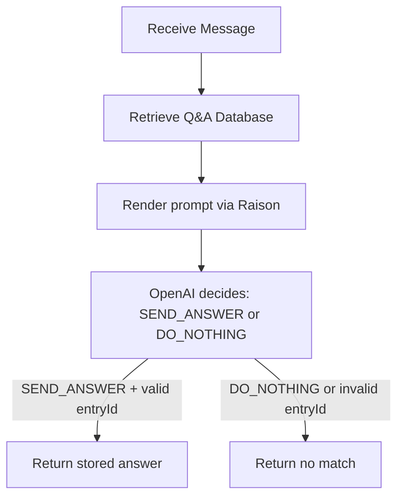
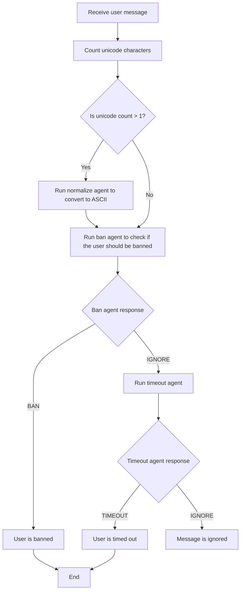

# AI Moderator for Livestreams

## Overview

AI moderator for livestream chats across YouTube, Twitch, and Kick. Two main agentic workflows:

1. **Q&A Agent** — matches chat questions to stored Q&A entries and returns the answer
2. **Evo Moderation Workflow** — normalize → ban → timeout pipeline for chat moderation

## Implementation Status

### Done

- Q&A CRUD API (`/api/qna`) with full create/read/update/delete
- Q&A agentic match endpoint (`POST /api/qna/match`) with Raison + OpenAI workflow
- `ModerationCatalog` global model with startup seeding of 13 canonical categories
- Moderation Categories CRUD API (`/api/moderation-categories`) with full create/read/update/delete
- Moderation category bootstrap endpoint (`POST /api/moderation-categories/bootstrap`) for bulk channel initialization from `ModerationCatalog`
- Category model with `channelId`, `catalogId`, `type` (`ban`|`timeout`), `label`, `normalizedLabel`, `definition`, `enabled` (`type` is per-channel — creators decide whether a category is a ban or timeout rule for their channel)
- Unique compound index on `channelId + type + normalizedLabel`
- Unique compound index on `channelId + catalogId`
- Strict query-param validation (rejects invalid/repeated/array-style `type` and `channelId`)
- DTO responses hide `_id`, `__v`, and internal `normalizedLabel`
- Evo moderation workflow service (`normalize → ban → timeout`) with Raison + OpenAI DI pattern
- Dynamic moderation JSON schema enums per stage using enabled `catalogId` values plus `NONE`
- Moderation evaluation endpoint (`POST /api/moderation/evaluate`)
- Chat ingestion event model with duplicate protection on `platform + messageId`
- Platform chat ingestion endpoint (`POST /api/chat/ingest`) orchestrating Q&A + Evo workflows from unified chat events
- YouTube producer action execution: sends matched Q&A answers, applies ban decisions, applies timeout decisions, and skips all action execution for duplicate ingests
- `ChatAction` audit/idempotency model with unique `platform + messageId + type` protection for Q&A replies, bans, and timeouts
- Env schema entries populated for all Raison prompt IDs
- OpenAI service extracted to reusable `createChatCompletion` with JSON schema response format
- Raison SDK integration for Q&A prompt rendering (`RAISON_QNA_PROMPT_ID`)
- Env helpers in `config/env.ts` (`getRequiredEnv`, `getOptionalEnv`)
- Backend startup preflight for prompt env in `config/env.ts`
- Shared test env mutation helper in `tests/helpers/env.ts`
- 350 backend tests passing, backend typecheck passing, frontend build and e2e passing
- WTF reviewer verified all features

### Not Yet Implemented

- Twitch/Kick producer runtimes and action execution

## Architecture Decisions

- All prompts stored/rendered via Raison SDK; no local prompt files in production
- OpenAI calls use raw `fetch` with JSON schema response format
- Agent output is structured JSON; backend returns only stored DB answers, never generated text
- Dependency injection via `QnaAgentDependencies` (or `EvoAgentDependencies`) with `app.locals` for test fakes
- Env helpers live in `config/env.ts`, not in individual services
- `ModerationCategory` is per-channel (`channelId` + `type` + `enabled`), `ModerationCatalog` is global (stable `catalogId` like `SCAM`, no `type` — creators decide type per channel); LLM `category_id` responses map to `catalogId`, never to `label`/`normalizedLabel`
- Chat ingestion deduplicates by `platform + messageId` and runs Q&A plus Evo moderation in parallel only for the first-seen event
- Production chat actions are executed by the YouTube producer after `/api/chat/ingest` returns a first-seen result; moderation actions take precedence over Q&A replies
- Use `wtf-implementer-glm-5.1` for implementation work when requested
- Use `wtf-reviewer` after every implementation to verify before marking done
- Shell commands prefixed with `rtk`
- Platform APIs must use `unified-creator-metrics`; no raw YouTube/Twitch/Kick API calls
- Frontend will use Gea + `@geajs/ui`
- Env vars managed with varlock and KeePassXC via `.env.schema`

## Canonical Moderation Categories

These 13 categories will be seeded into `ModerationCatalog` at startup. They are a flat list — `type` (ban/timeout) is a **per-channel decision**, not a catalog property. A creator decides for their channel whether SCAM is a ban rule or a timeout rule.

| Catalog ID | Label | Definition | Legacy Group |
|---|---|---|---|
| SCAM | Scam or phishing | Attempts to trick people into sending money or crypto, sharing credentials or wallet keys, or trusting fake giveaways, verification flows, recovery help, or guaranteed-return offers such as "send 1 BTC and get 2 BTC back." | ban fixture |
| THREAT | Threat | Threats of violence, wishes of harm, incitement, or targeted intimidation that imply real-world danger or retaliation. | ban fixture |
| MINOR_EXPLOITATION | Minor exploitation | Any sexual content involving minors, grooming, or child exploitation material or requests. | ban fixture |
| MALWARE | Malware | Attempts to distribute or recommend malicious files, stealers, keyloggers, phishing kits, suspicious executables, or harmful download links. | ban fixture |
| DOXXING | Doxxing | Sharing or soliciting private identifying information such as addresses, phone numbers, personal email, legal identity, documents, workplace, school, or family details. | ban schema only |
| SEVERE_HATE | Severe hate | Slurs, dehumanization, or explicit hostility toward protected groups based on identity such as race, ethnicity, religion, nationality, gender, sexuality, or disability. | ban schema only |
| SELF_PROMO | Self-promotion | Promoting your own channel, social account, server, store, referral code, or asking viewers to follow, sub, DM, or go elsewhere for non-deceptive promotion. | timeout fixture |
| INSULT | Insult | One-off personal abuse or name-calling aimed at a person, such as "idiot" or "shut up," without identity-based hate or sustained targeting. | timeout fixture |
| TROLLING | Trolling | Bad-faith baiting or provocation meant to derail chat, farm reactions, or start arguments without a direct threat or clear personal insult. | timeout fixture |
| SYMBOL_FLOOD | Symbol flood | Messages dominated by repeated caps, emoji, punctuation, symbols, or unreadable character walls rather than meaningful text. | timeout fixture |
| SEXUAL_LANGUAGE | Sexual language | Explicit sexual language, propositions, graphic descriptions, or sexual insults involving adults. Use minor exploitation instead if minors are involved. | timeout fixture |
| HARASSMENT | Harassment | Repeated or targeted abuse, stalking, dogpiling, or persistent unwanted targeting of a person across messages or over time. | timeout schema only |
| SPAM | Spam | Repetitive, copy-pasted, automated, or high-frequency posting, including repeated links or the same message across chat. Use self-promotion when the main issue is advertising. | timeout schema only |

These definitions are the current canonical defaults passed into per-channel category bootstraps; tune them carefully because they shape the moderation prompts.

## Q&A Agent Workflow



- Uses `QnaAgentDependencies` injected via `app.locals` for test fakes
- Production defaults: `RaisonQnaPromptRenderer` + `OpenAIQnaAgentModel`
- `QnaAgentModelDecision` is a discriminated union: `SEND_ANSWER` requires `entryId` + `reason: 'ANSWER_FOUND'`; `DO_NOTHING` requires `entryId: null` + `reason: 'NOT_A_QUESTION' | 'NO_DATABASE_MATCH'`
- Invalid agent selections (entryId not in retrieved entries) result in `DO_NOTHING` with reason `INVALID_AGENT_SELECTION`

## Evo Moderation Workflow



Implementation expectations:
- Normalize step only when unicode character count > 1
- Ban decision always runs before timeout
- If ban agent returns BAN, stop immediately (no timeout check)
- Timeout agent only runs when ban agent returns IGNORE
- If timeout agent returns IGNORE, no moderation action taken
- Only `enabled: true` categories for the channel are passed to each agent, grouped by the creator's chosen `type` (ban or timeout)
- Categories are rendered into the Raison prompt as `banCategories` / `timeoutCategories` Handlebars variables (grouped by the per-channel `type` field, not by the catalog)
- The JSON schema `category_id` enum is dynamically set to only the enabled `catalogId` values for that stage plus `NONE`
- If no categories are enabled for a stage, the `action` enum collapses to `["IGNORE"]`

## Q&A Agent Implementation Details

### OpenAI Response Format

The Q&A agent uses JSON schema structured output:

```json
{
  "type": "json_schema",
  "json_schema": {
    "name": "qna_agent_decision",
    "strict": true,
    "schema": {
      "type": "object",
      "properties": {
        "action": { "type": "string", "enum": ["SEND_ANSWER", "DO_NOTHING"] },
        "entryId": { "anyOf": [{ "type": "string" }, { "type": "null" }] },
        "reason": { "type": "string", "enum": ["ANSWER_FOUND", "NOT_A_QUESTION", "NO_DATABASE_MATCH"] }
      },
      "required": ["action", "entryId", "reason"]
    }
  }
}
```

### Parse Logic

`parseQnaAgentDecision` validates action/reason/entryId combinations:
- `SEND_ANSWER` requires `entryId: string` + `reason: 'ANSWER_FOUND'`
- `DO_NOTHING` requires `entryId: null` + `reason: 'NOT_A_QUESTION' | 'NO_DATABASE_MATCH'`
- Invalid `SEND_ANSWER` with a non-matching `entryId` becomes `DO_NOTHING` with reason `INVALID_AGENT_SELECTION`

### Raison Prompt

- Prompt ID: `6a10c0f77a74ff59899f61e5` (from legacy `constants.js`)
- Template variables: `channelId`, `messageText`, `qnaEntries` (array of `{id, question, answer}`)

## Moderation Category Implementation Details

### API Endpoints

- `POST /api/moderation-categories` — create (returns 201 or 409 on duplicate)
- `POST /api/moderation-categories/bootstrap` — bulk-create per-channel categories from the seeded catalog (returns 201 when any are created, 200 when all already exist, 400 on invalid bootstrap payload, 409 on channel conflicts)
- `GET /api/moderation-categories?channelId=X&type=ban` — list with filters (400 on invalid/repeated/array params)
- `GET /api/moderation-categories/:id` — get by ID (404 if missing)
- `PATCH /api/moderation-categories/:id` — update label/definition/enabled/type (409 on duplicate, 400 on invalid)
- `DELETE /api/moderation-categories/:id` — delete (204 or 404)

### Model Fields

| Field | Type | Notes |
|---|---|---|
| channelId | string | required |
| catalogId | string | required, stable catalog reference |
| type | string | enum: `ban`, `timeout` |
| label | string | required, stored as-is |
| normalizedLabel | string | required, internal, trim+lowercase+collapse whitespace |
| definition | string | required |
| enabled | boolean | default: true |
| createdAt | date | auto |
| updatedAt | date | auto |

### Key Validation

- Duplicate protection: unique index on `channelId + type + normalizedLabel`
- Duplicate protection: unique index on `channelId + catalogId`
- `type` query filter: rejects invalid values, repeated params (`?type=ban&type=timeout`), array syntax (`?type[]=ban`)
- `channelId` query filter: rejects non-string, empty, repeated, or array-style values
- `enabled` in POST/PATCH: rejects non-boolean values with 400
- Bootstrap requires every seeded `catalogId` exactly once and rejects duplicates, unknown IDs, and missing entries
- Stable sort: `{ createdAt: -1, _id: -1 }`

### Seeding Implementation

**Two-model architecture**:

- **`ModerationCatalog`** (global, no `channelId`, no `type`) — `catalogId` (unique, e.g. `SCAM`), `label`, `definition`. Upserted on startup. Creators decide `type` (ban/timeout) per channel.
- **`ModerationCategory`** (per-channel) — `channelId`, `catalogId` (references catalog), `type` (ban/timeout — creator's choice), `label`, `normalizedLabel`, `definition`, `enabled`.

**Current behavior**:
1. All 13 canonical categories are upserted into `ModerationCatalog` at startup.
2. Server startup fails fast if legacy `ModerationCategory` documents exist without `catalogId`.
3. The Evo agent sends only `enabled: true` per-channel categories, using `catalogId` as the OpenAI `category_id` enum value.
4. A bootstrap API bulk-creates per-channel `ModerationCategory` docs from the catalog using creator-provided `type` and `enabled` selections, while skipping existing `channelId + catalogId` entries.

## Chat Ingestion Implementation Details

### API Endpoint

- `POST /api/chat/ingest` — ingest a unified chat event, dedupe on `platform + messageId`, run Q&A and Evo moderation for first-seen events, return 201 for new ingests and 200 for duplicates

### Request Fields

| Field | Type | Notes |
|---|---|---|
| channelId | string | internal channel ID used by Q&A and moderation workflows |
| messageId | string | platform message ID, dedupe key with `platform` |
| authorExternalId | string | external author ID from unified chat source |
| channelExternalId | string | external channel ID from unified chat source |
| platform | string | enum: `youtube`, `twitch`, `kick` |
| sentAt | string | ISO-like date string, validated and stored as date |
| text | string | chat message content |

### Behavior

1. The first-seen `platform + messageId` reserves and stores a `ChatEvent` record before any workflow runs.
2. Duplicate ingests return the stored event and skip Q&A/moderation reruns.
3. Q&A and Evo moderation run in parallel for new ingests.
4. If a workflow fails after reservation, the reserved `ChatEvent` is deleted before the error is rethrown.

## Backend Stack

- **Runtime**: Node.js (>=20.19.0)
- **Framework**: Express 5
- **Database**: MongoDB via Mongoose 8
- **Testing**: Vitest + Supertest + memgoose (in-memory MongoDB)
- **Prompts**: Raison SDK (`raison` npm package)
- **LLM**: OpenAI via raw `fetch` (no SDK dependency)
- **Env**: varlock + KeePassXC
- **TypeScript**: strict, ESM modules

## Shell Commands

| Command | Purpose |
|---|---|
| `rtk npm run test:backend` | Run all backend tests (from workspace root) |
| `rtk npm run test:backend:coverage` | Run tests with coverage |
| `rtk npm run typecheck:backend` | TypeScript type checking |
| `rtk npm run build:backend` | Build backend |
| `rtk npm run dev` | Dev server with watch (from `backend/` dir) |

## Environment Variables

Defined in `.env.schema`:

| Variable | Required | Description |
|---|---|---|
| `APP_ENV` | no | Environment (default: `dev`) |
| `PORT` | no | Server port (default: 3000) |
| `KP_PASSWORD` | yes | KeePassXC database password |
| `OPENAI_API_KEY` | yes | OpenAI API key |
| `OPENAI_MODEL` | no | OpenAI model (default: `gpt-5.4-nano`) |
| `RAISON_API_KEY` | yes | Raison API key |
| `RAISON_QNA_PROMPT_ID` | yes | Raison prompt ID for Q&A agent (`6a10c0f77a74ff59899f61e5`) |
| `RAISON_NORMALIZE_PROMPT_ID` | yes | Raison prompt ID for the normalize moderation agent (`6a1775683bed3b22a56548d7`) |
| `RAISON_BAN_PROMPT_ID` | yes | Raison prompt ID for the ban moderation agent (`6a1776613bed3b22a5654afc`) |
| `RAISON_TIMEOUT_PROMPT_ID` | yes | Raison prompt ID for the timeout moderation agent (`6a1773313bed3b22a56545ec`) |
| `MONGODB_URI` | yes | MongoDB connection string |
| `YOUTUBE_TIMEOUT_DURATION_SECONDS` | no | Duration for timeout moderation actions (default: `300`) |

Producer runtime env:

- `PRODUCER_CHANNEL_ID` - internal moderation channel ID used when ingesting external chat
- `YOUTUBE_LIVE_VIDEO_ID` - live video ID to attach the YouTube chat listener to
- `PRODUCER_INGEST_BASE_URL` - optional base URL for the local backend ingest endpoint, defaults to `http://127.0.0.1:<PORT>`
- `YOUTUBE_API_KEY`, `YOUTUBE_ACCESS_TOKEN`, or a stored Google OAuth token for `PRODUCER_CHANNEL_ID` - enables the YouTube client
- `YOUTUBE_CHAT_POLLING_INTERVAL_MS` - optional listener polling interval override
- `YOUTUBE_CHAT_MAX_RESULTS` - optional per-poll message limit override
- `YOUTUBE_CHAT_INCLUDE_HISTORY` - optional flag for first-poll history inclusion
- `YOUTUBE_TIMEOUT_DURATION_SECONDS` - optional timeout duration override

## Next Steps

1. **Deploy the producer runtime** — Keep the YouTube-first `unified-creator-metrics` listener pointed at `POST /api/chat/ingest` in the target environment.

2. **Frontend** — Build the streamer management UI with Gea + @geajs/ui.
